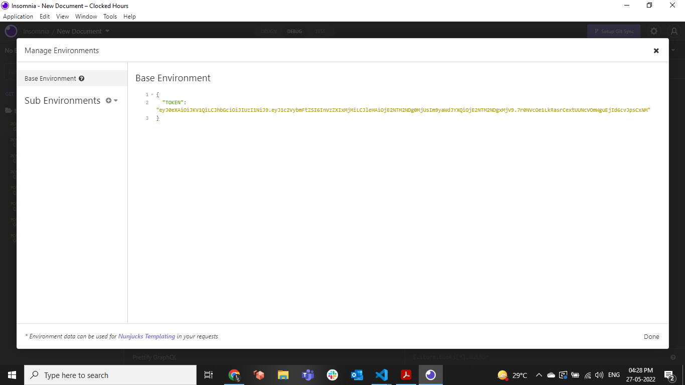
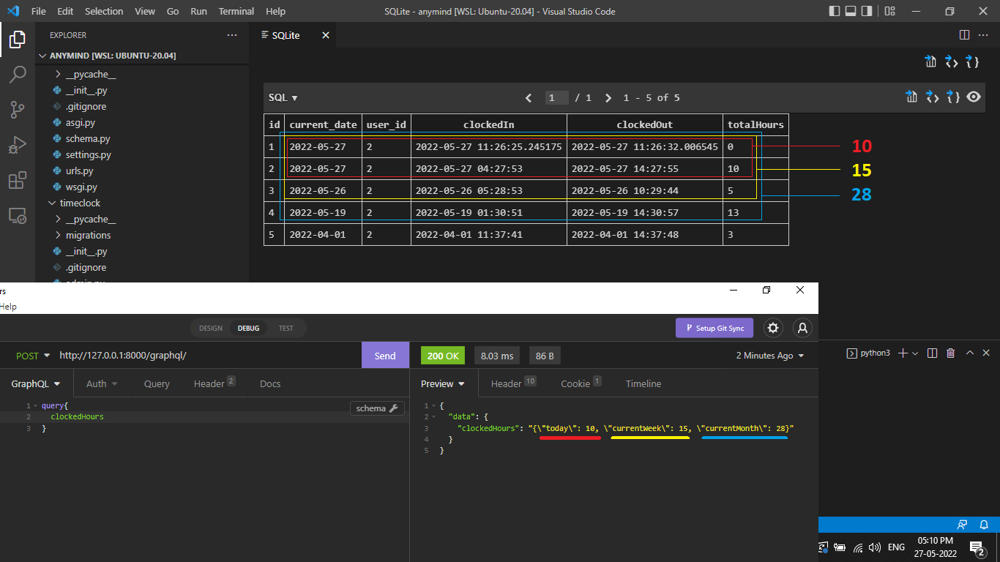

**This v2Project is a demonstration of Using GraphQL with Django for the Time Clocking of Users.
A User can Clock In/Out, check total clocked Hours in the current Day/Week/Month.
All activites require a user to be authenticated using JWT.**

# Setup
1a. Install Insomnia Client using `https://insomnia.rest/`
We will use it to make queries to our GraphQL endpoint.

1b. Open up a Terminal and follow the commands
```
from airflow import DAG
from airflow.operators.python import PythonOperator
import pendulum
from airflow.models.taskinstance import TaskInstance as ti


def _transform(ti: ti):
    import requests
    resp = requests.get(f'https://swapi.dev/api/people/1').json()
    print(resp)
    my_character = {}
    my_character["height"] = int(resp["height"]) - 20
    my_character["mass"] = int(resp["mass"]) - 13
    my_character["hair_color"] = "black" if resp["hair_color"] == "blond" else "blond"
    my_character["eye_color"] = "hazel" if resp["eye_color"] == "blue" else "blue"
    my_character["gender"] = "female" if resp["gender"] == "male" else "female"
    ti.xcom_push("character_info", my_character)

def _load(ti: ti):
    print(ti.xcom_pull(key = 'character_info',task_ids = ['_transform']))

with DAG(
    'xcoms_demo_1',
    schedule = None,
    start_date = pendulum.datetime(2023,3,1),
    catchup = False
):
    
    t1 = PythonOperator(
        task_id = '_transform',
        python_callable = _transform
    )

    t2 = PythonOperator(
        task_id = 'load',
        python_callable = _load
    )

    t1 >> t2
```

# Make Django 4.x changes for JWT 


```
PYTHON_VERSION="$(python --version | cut -d " " -f 2 | cut -d "." -f 1-2)"
sudo rm -r $(pwd)/venv/lib/python$PYTHON_VERSION/site-packages/graphql_jwt -f
cp modules/graphql_jwt $(pwd)/venv/lib/python$PYTHON_VERSION/site-packages/ -r
```

# Setup Database

```
python3 manage.py makemigrations timeclock
python3 manage.py makemigrations
python3 manage.py migrate
python3 manage.py createsuperuser
```

# Start Server

```
python3 manage.py runserver
```

Access API at `http://127.0.0.1:8000/graphql/`

# Create Account
```
mutation{
  createUser(
    username: "user123"
    email: "user123@user.com"
    password1: "!@#qwe!@#qwe"
    password2: "!@#qwe!@#qwe"
  ){
    success
    errors
  }
}
```

Copy the Activation Token as displayed on the terminal. This is to verify a User Account.


# Activate account 

Use your previously copied **Activation Token** from ` http://127.0.0.1:8000/activate/YOUR_TOKEN` in the Query

```
mutation{
  verifyAccount(
      token:"YOUR_TOKEN"
  ){
    success
    errors
  }
}
```

# Obtain JWT Token

```
mutation{
  obtainToken(username:"user123",
  password:"!@#qwe!@#qwe"){
    token
  }
}
```

Copy the **JWT Token** in the Response. we will use it for the following query authentication.

# Use Insomnia API CLient to test the API 

* In your environment, add your token to use as variable `_.TOKEN` in the following queries

```
{
	"TOKEN": "YOUR_JWT_TOKEN"
}
```


* Create the following queries by setting body as `GraphQL Query`
* In the Header, set 
    * `Content-Type`  : `application/json`
    * `Authorization` : `JWT _.TOKEN`


# Me

```
query{
  me{
    username
    email
  }
}
```

# ClockIn

```
mutation{
  clockIn{
    clock{
      clockedIn
      clockedOut
    }
  }
}
```

# CurrentClock

```
query{
  currentClock{
    clockedIn
    clockedOut
  }
}
```

# ClockOut 

```
mutation{
  clockOut{
    clock{
      clockedIn
      clockedOut
    }
  }
}
```

# ClockedHours

```
query{
  clockedHours
}
```



# Django Admin

You can also add Data for testing using the Django admin.
Go to `http://127.0.0.1:8000/admin/` and login using your superuser credentials

